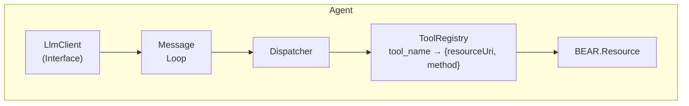

# BEAR.ToolUse

BEAR.SundayアプリケーションをAIエージェント対応にするライブラリ。

リソースクラスからTool Use定義を自動生成し、LLMとのエージェントループを管理します。

## 特徴

- リソースクラスからJSON Schemaベースのツール定義を自動生成
- JSON Schema、ALPSプロファイル、PHPDocによるパラメータ説明の補強
- `#[Tool]`と`#[Exclude]`アトリビュートによる公開制御
- URIベースのリソース指定（`app://self/user`、`page://self/article`）
- LLM実装に依存しない設計（インターフェイスのみ提供）

## 要件

- PHP 8.2以上
- BEAR.Sunday

## インストール

```bash
composer require bear/tool-use
```

## 使用方法

### 1. リソースクラスの定義

```php
<?php

namespace MyApp\Resource\App;

use BEAR\Resource\ResourceObject;
use BEAR\ToolUse\Attribute\Tool;

#[Tool(description: 'ユーザー情報を管理')]
class User extends ResourceObject
{
    /**
     * ユーザーを取得
     *
     * @param int $id ユーザーID
     */
    public function onGet(int $id): static
    {
        $this->body = ['id' => $id, 'name' => 'John'];
        return $this;
    }

    /**
     * ユーザーを作成
     *
     * @param string $name ユーザー名
     * @param string $email メールアドレス
     */
    public function onPost(string $name, string $email): static
    {
        $this->body = ['id' => 1, 'name' => $name, 'email' => $email];
        return $this;
    }
}
```

### 2. LLMクライアントの実装

```php
<?php

namespace MyApp\Llm;

use BEAR\ToolUse\Llm\LlmClientInterface;
use BEAR\ToolUse\Llm\LlmResponse;
use BEAR\ToolUse\Runtime\Message;
use BEAR\ToolUse\Schema\Tool;

final class MyLlmClient implements LlmClientInterface
{
    /**
     * @param list<Message> $messages
     * @param list<Tool> $tools
     */
    public function chat(string $system, array $messages, array $tools): LlmResponse
    {
        // LLM APIを呼び出してレスポンスを返す
    }
}
```

### 3. DIモジュールの設定

```php
<?php

namespace MyApp\Module;

use BEAR\ToolUse\Llm\LlmClientInterface;
use BEAR\ToolUse\Module\ToolUseModule;
use MyApp\Llm\MyLlmClient;
use Ray\Di\AbstractModule;

final class AppModule extends AbstractModule
{
    protected function configure(): void
    {
        $this->install(new ToolUseModule());
        $this->bind(LlmClientInterface::class)->to(MyLlmClient::class);
    }
}
```

### 4. エージェントの実行

```php
<?php

use BEAR\ToolUse\Runtime\AgentFactory;

// ファクトリーでエージェントを作成（URIベース）
$agent = $factory
    ->addResources([
        'app://self/user',
        'app://self/article',
        'page://self/search',
    ])
    ->create('あなたは親切なアシスタントです。');

// エージェントを実行
$response = $agent->run('ID 123のユーザー情報を教えてください');

if ($response->completed) {
    echo $response->getText();
}
```

### 5. 会話履歴

エージェントは複数の `run()` 呼び出しにわたって会話履歴を保持します。

```php
// 会話を継続
$response = $agent->run('そのユーザーのメールアドレスは？');

// メッセージ履歴にアクセス
$messages = $agent->messages;

// 後で使用するために保存（例：DBやセッションに）
$savedHistory = $agent->messages;

// 会話を復元して継続
$agent->messages = $savedHistory;
$response = $agent->run('このユーザーについてもっと教えて');

// 履歴をクリアして新しい会話を開始
$agent->reset();
```

## ツール公開の制御

### メソッド単位での除外

```php
use BEAR\ToolUse\Attribute\Exclude;

class User extends ResourceObject
{
    public function onGet(int $id): static { /* 公開される */ }

    #[Exclude]
    public function onDelete(int $id): static { /* 除外 */ }
}
```

### クラス全体を除外

```php
use BEAR\ToolUse\Attribute\Exclude;

#[Exclude]
class InternalResource extends ResourceObject
{
    // このリソースの全メソッドが除外
}
```

### カスタムツール名と説明

```php
use BEAR\ToolUse\Attribute\Tool;

#[Tool(name: 'search_users', description: 'ユーザーを検索')]
public function onGet(string $query): static { /* ... */ }
```

## JSON Schemaの統合

BEAR.ResourceのJSON Schemaを使用してパラメータ定義を強化できます。

### 1. JsonSchemaModuleと共にインストール

```php
use BEAR\Resource\Module\JsonSchemaModule;
use BEAR\ToolUse\Module\ToolUseModule;

$this->install(
    new JsonSchemaModule(
        $this->appMeta->appDir . '/var/json_schema',
        $this->appMeta->appDir . '/var/json_validate',
    ),
);
$this->install(new ToolUseModule());
```

### 2. JSON Schemaの定義

```json
// /path/to/validate/user.json
{
    "type": "object",
    "properties": {
        "id": {
            "type": "integer",
            "description": "ユーザーID",
            "minimum": 1
        },
        "status": {
            "type": "string",
            "description": "ユーザーステータス",
            "enum": ["active", "inactive", "pending"]
        }
    }
}
```

### 3. リソースへの適用

```php
use BEAR\Resource\Annotation\JsonSchema;

class User extends ResourceObject
{
    #[JsonSchema(params: 'user.json')]
    public function onGet(int $id, string $status = 'active'): static
    {
        // JSON Schemaによるランタイムバリデーションとツール定義の両方に使用
    }
}
```

JSON Schemaから以下のプロパティが抽出されます：
- `description` - パラメータの説明
- `enum` - 許可される値
- `format` - 値のフォーマット（email、uri、date等）
- `minimum` / `maximum` - 数値の範囲
- `minLength` / `maxLength` - 文字列の長さ
- `pattern` - 正規表現パターン

## ALPSによるセマンティック記述

ALPSプロファイルを使用してパラメータの説明を補強できます。

```php
use BEAR\ToolUse\Schema\AlpsSemanticDictionary;
use BEAR\ToolUse\Schema\SchemaConverter;

$dictionary = new AlpsSemanticDictionary('/path/to/profile.json');
$converter = new SchemaConverter($dictionary);
```

ALPSプロファイルの`semantic`記述子から`title`または`doc.value`がパラメータの説明として使用されます。

## パラメータ説明の優先順位

複数のソースが説明を提供する場合、以下の順序で解決されます：

1. **JSON Schema** - スキーマファイルの`description`プロパティ
2. **ALPS** - セマンティック記述子の`title`または`doc.value`
3. **PHPDoc** - `@param`タグの説明

## アーキテクチャ



## エラーフィードバックループ

ツール実行が失敗した場合、エラーは自動的にLLMにフィードバックされ、LLMはパラメータを修正して再試行したり、別のアクションを取ることができます。例外ベースのエラーと非2xxステータスコードの両方に対応しています。

```
ユーザー: 「ユーザー999を削除して」
  ↓
LLM: tool_use → user_delete(id: 999)
  ↓
Dispatcher: 404 Not Found → ToolResult(isError: true)
  ↓
LLMがエラーを受信し、次のアクションを決定
  ↓
LLM: 「ユーザー999は見つかりませんでした。」
```

Dispatcherが検出するエラー:

| エラー種別 | 例 | エラーメッセージ形式 |
|-----------|---|-------------------|
| 例外 | `ResourceNotFoundException` | `BEAR\Resource\Exception\ResourceNotFoundException: /user?id=999` |
| ステータスコード | `$this->code = 400` | `400: {"error":"Validation failed"}` |
| 未知のツール | 未登録のツール | `Unknown tool: foo_bar` |

## API

### インターフェイス

| インターフェイス | 説明 |
|-----------------|------|
| `LlmClientInterface` | LLM APIクライアント（ユーザー実装） |
| `DispatcherInterface` | ツール呼び出しのディスパッチ |
| `ToolRegistryInterface` | ツール名とリソースのマッピング |
| `SchemaConverterInterface` | リソースからツール定義への変換 |
| `ToolCollectorInterface` | ツールの収集と登録 |
| `AgentInterface` | エージェントランタイム |

### 主要クラス

| クラス | 説明 |
|-------|------|
| `Agent` | LLMとの会話ループを管理 |
| `AgentFactory` | エージェントのビルダー |
| `AgentResponse` | エージェント実行結果 |
| `Tool` | ツール定義（JSON Schema） |
| `ToolCall` | LLMからのツール呼び出し |
| `ToolResult` | ツール実行結果 |
| `Message` | 会話メッセージ |
| `LlmResponse` | LLMからのレスポンス |

## 開発

```bash
# 開発ツールのセットアップ
composer setup

# テスト実行
composer test

# コーディング規約チェック
composer cs

# 静的解析
composer sa

# 全チェック実行
composer tests
```

## ライセンス

MIT License
