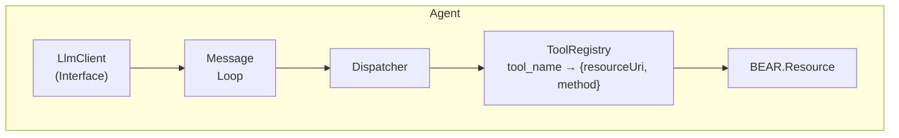

# BEAR.ToolUse

A library that enables AI agent capabilities for BEAR.Sunday applications.

Automatically generates Tool Use definitions from resource classes and manages the agent loop with LLMs.

## Features

- Auto-generates JSON Schema-based tool definitions from resource classes
- Enhances parameter descriptions using JSON Schema, ALPS profiles, and PHPDoc
- Controls tool exposure via `#[Tool]` and `#[Exclude]` attributes
- URI-based resource specification (`app://self/user`, `page://self/article`)
- LLM-agnostic design (provides interfaces only)

## Requirements

- PHP 8.2+
- BEAR.Sunday

## Installation

```bash
composer require bear/tool-use
```

## Usage

### 1. Define Resource Classes

```php
<?php

namespace MyApp\Resource\App;

use BEAR\Resource\ResourceObject;
use BEAR\ToolUse\Attribute\Tool;

#[Tool(description: 'Manage user information')]
class User extends ResourceObject
{
    /**
     * Get a user
     *
     * @param int $id User ID
     */
    public function onGet(int $id): static
    {
        $this->body = ['id' => $id, 'name' => 'John'];
        return $this;
    }

    /**
     * Create a user
     *
     * @param string $name User name
     * @param string $email Email address
     */
    public function onPost(string $name, string $email): static
    {
        $this->body = ['id' => 1, 'name' => $name, 'email' => $email];
        return $this;
    }
}
```

### 2. Implement LLM Client

```php
<?php

namespace MyApp\Llm;

use BEAR\ToolUse\Llm\LlmClientInterface;
use BEAR\ToolUse\Llm\LlmResponse;
use BEAR\ToolUse\Runtime\Message;
use BEAR\ToolUse\Schema\Tool;

final class MyLlmClient implements LlmClientInterface
{
    /**
     * @param list<Message> $messages
     * @param list<Tool> $tools
     */
    public function chat(string $system, array $messages, array $tools): LlmResponse
    {
        // Call LLM API and return response
    }
}
```

### 3. Configure DI Module

```php
<?php

namespace MyApp\Module;

use BEAR\ToolUse\Llm\LlmClientInterface;
use BEAR\ToolUse\Module\ToolUseModule;
use MyApp\Llm\MyLlmClient;
use Ray\Di\AbstractModule;

final class AppModule extends AbstractModule
{
    protected function configure(): void
    {
        $this->install(new ToolUseModule());
        $this->bind(LlmClientInterface::class)->to(MyLlmClient::class);
    }
}
```

### 4. Run the Agent

```php
<?php

use BEAR\ToolUse\Runtime\AgentFactory;

// Create agent with factory (URI-based)
$agent = $factory
    ->addResources([
        'app://self/user',
        'app://self/article',
        'page://self/search',
    ])
    ->create('You are a helpful assistant.');

// Run the agent
$response = $agent->run('Please get user information for ID 123');

if ($response->completed) {
    echo $response->getText();
}
```

### 5. Conversation History

The agent maintains conversation history across multiple `run()` calls.

```php
// Continue conversation
$response = $agent->run('What is their email?');

// Access message history
$messages = $agent->messages;

// Save for later (e.g., to database or session)
$savedHistory = $agent->messages;

// Restore conversation and continue
$agent->messages = $savedHistory;
$response = $agent->run('Tell me more about this user');

// Clear history to start fresh
$agent->reset();
```

## Controlling Tool Exposure

### Exclude Specific Methods

```php
use BEAR\ToolUse\Attribute\Exclude;

class User extends ResourceObject
{
    public function onGet(int $id): static { /* Exposed */ }

    #[Exclude]
    public function onDelete(int $id): static { /* Hidden */ }
}
```

### Exclude Entire Class

```php
use BEAR\ToolUse\Attribute\Exclude;

#[Exclude]
class InternalResource extends ResourceObject
{
    // All methods in this resource are hidden
}
```

### Custom Tool Name and Description

```php
use BEAR\ToolUse\Attribute\Tool;

#[Tool(name: 'search_users', description: 'Search for users')]
public function onGet(string $query): static { /* ... */ }
```

## JSON Schema Integration

Use BEAR.Resource's JSON Schema for enhanced parameter definitions.

### 1. Install with JsonSchemaModule

```php
use BEAR\Resource\Module\JsonSchemaModule;
use BEAR\ToolUse\Module\ToolUseModule;

$this->install(
    new JsonSchemaModule(
        $this->appMeta->appDir . '/var/json_schema',
        $this->appMeta->appDir . '/var/json_validate',
    ),
);
$this->install(new ToolUseModule());
```

### 2. Define JSON Schema

```json
// /path/to/validate/user.json
{
    "type": "object",
    "properties": {
        "id": {
            "type": "integer",
            "description": "User ID",
            "minimum": 1
        },
        "status": {
            "type": "string",
            "description": "User status",
            "enum": ["active", "inactive", "pending"]
        }
    }
}
```

### 3. Apply to Resource

```php
use BEAR\Resource\Annotation\JsonSchema;

class User extends ResourceObject
{
    #[JsonSchema(params: 'user.json')]
    public function onGet(int $id, string $status = 'active'): static
    {
        // JSON Schema provides both runtime validation and tool definitions
    }
}
```

The following properties are extracted from JSON Schema:
- `description` - Parameter description
- `enum` - Allowed values
- `format` - Value format (email, uri, date, etc.)
- `minimum` / `maximum` - Numeric range
- `minLength` / `maxLength` - String length
- `pattern` - Regex pattern

## ALPS Semantic Descriptions

Use ALPS profiles to enhance parameter descriptions.

```php
use BEAR\ToolUse\Schema\AlpsSemanticDictionary;
use BEAR\ToolUse\Schema\SchemaConverter;

$dictionary = new AlpsSemanticDictionary('/path/to/profile.json');
$converter = new SchemaConverter($dictionary);
```

The `title` or `doc.value` from ALPS `semantic` descriptors will be used as parameter descriptions.

## Parameter Description Priority

When multiple sources provide descriptions, they are resolved in this order:

1. **JSON Schema** - `description` property from schema file
2. **ALPS** - `title` or `doc.value` from semantic descriptor
3. **PHPDoc** - `@param` tag description

## Architecture



## Error Feedback Loop

When a tool execution fails, the error is automatically fed back to the LLM, which can then retry with corrected parameters or take alternative action. This works for both exception-based errors and non-2xx status codes.

```
User: "Delete user 999"
  ↓
LLM: tool_use → user_delete(id: 999)
  ↓
Dispatcher: 404 Not Found → ToolResult(isError: true)
  ↓
LLM receives error, decides next action
  ↓
LLM: "User 999 was not found."
```

Errors detected by the Dispatcher:

| Error Type | Example | Error Message Format |
|------------|---------|---------------------|
| Exception | `ResourceNotFoundException` | `BEAR\Resource\Exception\ResourceNotFoundException: /user?id=999` |
| Status code | `$this->code = 400` | `400: {"error":"Validation failed"}` |
| Unknown tool | Tool not registered | `Unknown tool: foo_bar` |

## API

### Interfaces

| Interface | Description |
|-----------|-------------|
| `LlmClientInterface` | LLM API client (user implementation) |
| `DispatcherInterface` | Dispatches tool calls |
| `ToolRegistryInterface` | Maps tool names to resources |
| `SchemaConverterInterface` | Converts resources to tool definitions |
| `ToolCollectorInterface` | Collects and registers tools |
| `AgentInterface` | Agent runtime |

### Main Classes

| Class | Description |
|-------|-------------|
| `Agent` | Manages conversation loop with LLM |
| `AgentFactory` | Builder for agents |
| `AgentResponse` | Agent execution result |
| `Tool` | Tool definition (JSON Schema) |
| `ToolCall` | Tool call from LLM |
| `ToolResult` | Tool execution result |
| `Message` | Conversation message |
| `LlmResponse` | Response from LLM |

## Development

```bash
# Setup development tools
composer setup

# Run tests
composer test

# Check coding standards
composer cs

# Static analysis
composer sa

# Run all checks
composer tests
```

## Documentation

- [README.ja.md](README.ja.md) - Japanese documentation

## License

MIT License
